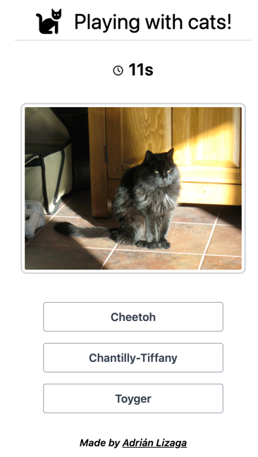
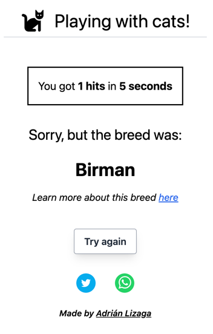

# Playing with cats frontend

UI for the playing with cats game.




## Running the app

```bash
npm install
npm start
```

## Playing the game

[Playing with cats!](https://playing-with-cats.up.railway.app/)
